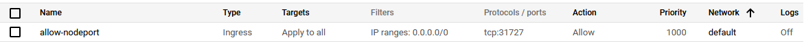

## Setup instructions

```bash
cd deploy/k8s
k apply -f locust/
```

This will deploy locust load testing tool on to the K8s cluster in master &
worker mode.

## Search for public IP and port.

You need to know what are the public address the nodes are interfacing so that
you can access to it:

    > kubectl get nodes -o wide |  awk {'print $1" " $2 " " $7'} | column -t
    NAME                                         STATUS  EXTERNAL-IP
    ip-x-x-x-x.ap-southeast-1.compute.internal   Ready   x.x.x.x
    ip-y-y-y-y.ap-southeast-1.compute.internal   Ready   y.y.y.y

You also need to know what port are the NodePort service running on:

    > kubectl get service/locust-service
    NAME             TYPE       CLUSTER-IP     EXTERNAL-IP   PORT(S)          AGE
    locust-service   NodePort   10.100.3.131   <none>        8089:31727/TCP   26h

Add Firewall rule like this replace <tcp: 31727>- 

Or use deploy/gcloud/cli.py

```bash
export NODE_PORT=31727
./cli.py allowNodePort
```

From there you access `http://x.x.x.x:32535` or `http://y.y.y.y:32535`

> Credits - [mosesliao](https://github.com/mosesliao)

> Adapted from
> _[Original Repo/source](https://github.com/mosesliao/kubernetes-locust.git)_
