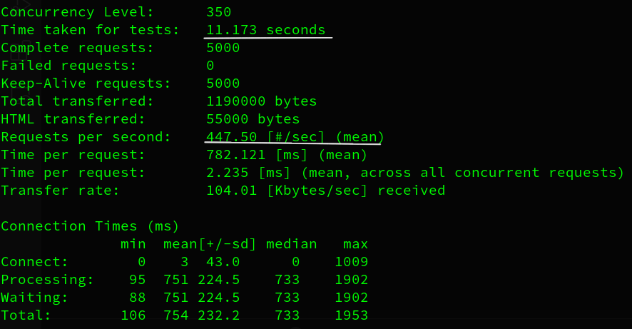
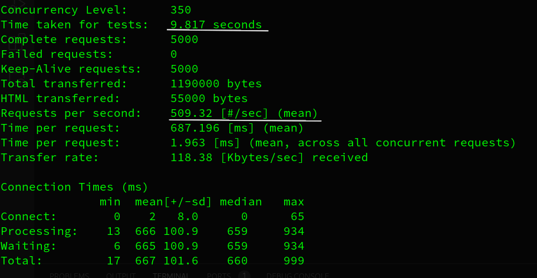
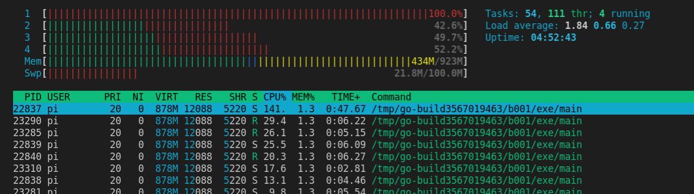

# RESTful APIs benchmark with AB tool

1. Express - NodeJS
1. FastAPI - Python
1. Fiber - GoLang

## Hardware

- Raspberry Pi Model 3
- Specs -
    - Quad Core 1.2 GHz 64-bit Cortex A53
    - 1GB RAM
    - 100 Mbps Ethernet

## Software 

- Operating system
    - Kernel - 5.10.52-v7+
    - Arm Arch - armv7l 
    - Raspberry PI OS
- Runtime versions
    - Python 3.8.9
    - Node v14.17.4
    - Go v1.16.6
- Apache Benchmark (AB tool) for the stress test

## Benchmarks

### 1. FastAPI (Python)

**Sync**

**Async**

### 2. Express (NodeJS)

**Sync**

**Async**

### 3. Fiber (Go Lang)

**5k requests**

**500k requests**

**CPU util in 500k requests test**

## Summary

Clearly Fiber (Golang) is way ahead of the game interms of speed and raw performance. Express (NodeJS) is ~2x faster than Python (FastAPI) and the these frameworks are ~12.5 and ~27.8 times respectively slower than Fiber. 

However, this doesn't mean that you no longer use Python or NodeJS based frameworks. Your current software stack along with the dev skills you have in your team will play an important role in making these decisions. 

We use Python and Node based RESTful APIs extensively, absolute performance becomes relavent when you are doing things at scale. These benchmarks are solely in terms of raw speed / throughput and do not consider things like developement speed example - existing eco-system and available resources. 

General recommendation is that you choose Python based RESTful framework when you are say working with AI/ML based services or your team knows Python well. And same goes for NodeJS based framework decisions, there is no silver bullet here!

Hope this gave you some perspective. Feel free to share comments and feedback.

Author - [Nikhil Akki](http://nikhilakki.in)

